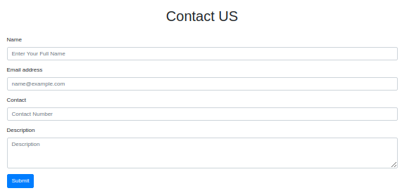
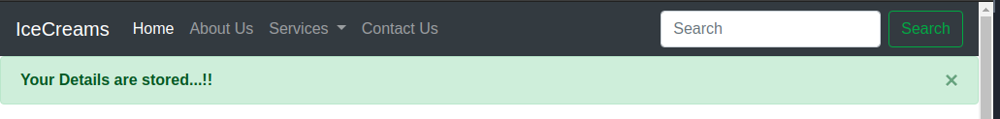

# Django-Starting
My another project of the Django Framework

In this particular project I am worked on the part of Database handling (sqlite3) and Models (Django)

In this project I designed a contact us form and store their data into my database with the help of models in Django framework


## How to Get this in your system

Open Terminal or command prompt and run following command

```bash
git clone https://github.com/pradhyumvyas/Django-Starting.git
```

Then open directory where you clone this repo then go to Hello directory and run following command in your terminal

```bash
python3 manage.py runserver
```

For window user run following command in your command prompt
```bash
python manage.py runserver
```

**First Make sure you have already install python3 and git in your system


## Some Snap for current project

1.


2.
